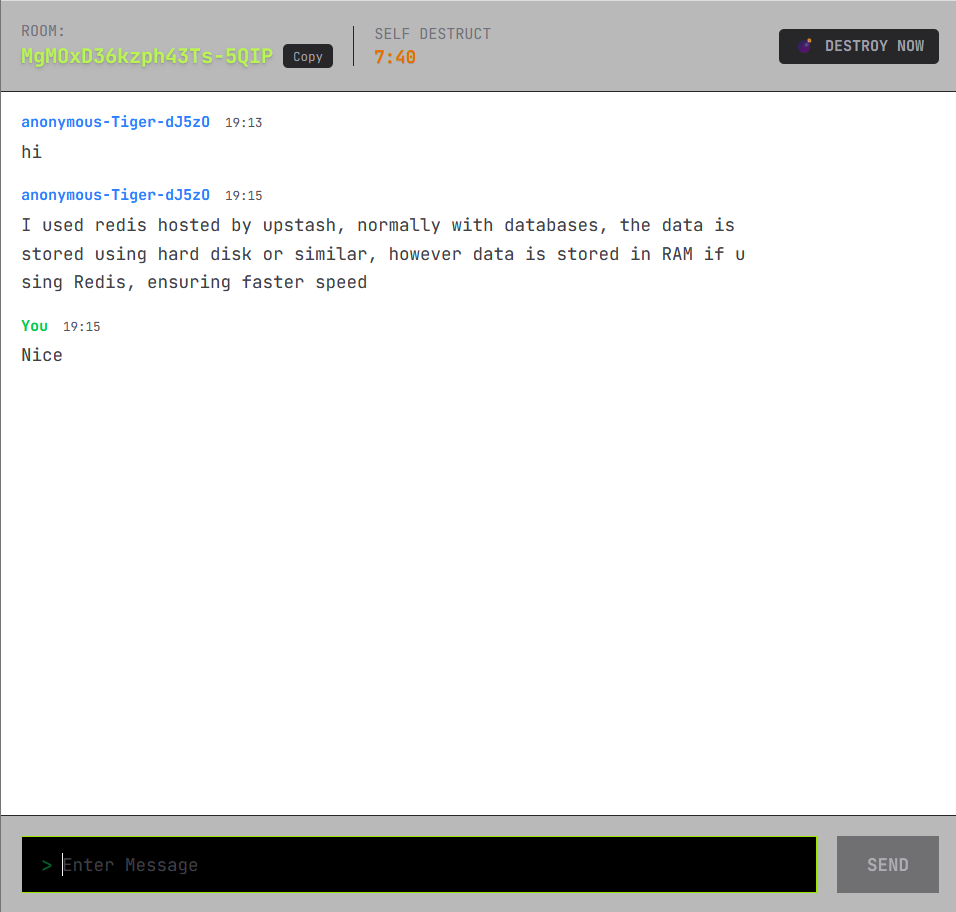

# Real-Time-Chat-Nextjs

A private, self-destructing real-time chat app built with Next.js, Elysia, Upstash Redis, and TanStack Query.


## Overview

This project was built while following a tutorial by Josh Tried Coding and then adapted into a room-based chat app with:

- room creation and sharing
- Redis message storage
- real-time messaging
- cookie-based room access validation
- a lightweight, terminal-inspired UI

<table align="center">
  <tr>
    <td align="center">
      <kbd></kbd>
      <br />
      <b>Lobby</b>
    </td>
    <td align="center">
      <kbd></kbd>
      <br />
      <b>Chat Room</b>
    </td>
  </tr>
</table>

## Table of Contents

- [Overview](#overview)
- [Features](#features)
- [Tech Stack](#tech-stack)
- [Getting Started](#getting-started)
- [How It Works](#how-it-works)
- [Project Notes](#project-notes)
- [Folder Structure](#folder-structure)
- [Tutorial Credit](#tutorial-credit)
- [My Personal Notes](#my-personal-notes)


## Features

- Create a unique chat room in one click.
- Share the room URL with other users.
- Keep message history in Redis with room TTL cleanup.
- Validate room access with middleware and cookies.
- Send and fetch messages using TanStack Query.
- Generate simple, readable anonymous usernames in the browser.

## Tech Stack

- Next.js 16
- React
- TypeScript
- Elysia
- Upstash Redis
- Upstash Realtime
- TanStack Query
- Zod
- nanoid
- Tailwind CSS

## Getting Started

### Prerequisites

- Node.js installed
- Redis and Realtime environment variables configured for Upstash

### Installation

```bash
npm install
```

### Development

```bash
npm run dev
```

Then open:

```bash
http://localhost:3000
```

## How It Works

1. A user opens the home page and receives a locally stored anonymous username.
2. Clicking **Create Secure Room** creates a new room id on the server.
3. The app redirects to `/room/[roomId]`.
4. Middleware validates access and attaches a room token cookie.
5. Messages are stored in Redis and broadcast through Realtime.
6. Room metadata expires automatically after the configured TTL.

## Project Notes

- `useState(() => ...)` is used for one-time client-only initialization.
- `useMutation` handles sending messages without manual loading state management.
- `useQuery` keeps the message list synced with the server.
- Zod is used to validate room and message payloads.
- Redis TTL is used to keep rooms temporary and self-destructing.

## Folder Structure

```text
src/
  app/
    api/
      [[...slugs]]/
        route.ts
    components/
      providers.tsx
    room/
      [roomId]/
        page.tsx
    globals.css
    layout.tsx
    page.tsx
  hooks/
    use-username.ts
  lib/
    client.ts
    realtime.ts
    realtime-client.ts
    redis.ts
  proxy.ts
```

## Tutorial Credit

This project was inspired by the following tutorial:

<p align="center">
  <a href="https://youtu.be/D8CLV-MRH0k">
    
  </a>
</p>


## My Personal Notes

<details>
  <summary>My Personal Notes</summary>

  - Installed Elysia for routing and server handling.
  - Installed TanStack Query for enhanced React data hooks.
  - Installed nanoid for easy unique ID generation.
  - Installed Upstash Redis for cloud-hosted chat data.
  - Stored usernames in browser localStorage using `localStorage.setItem(STORAGE_KEY, generated)`.
  - Used `useState(() => ...)` for one-time client-side initialization.
  - Created unique cookie generation with nanoid and validated it with middleware.
  - Used Zod to prevent abuse with message length validation and request checks.
  - Used date-fns for formatting time into readable strings.
  - Used `await Promise.all([...])` when multiple async operations can run in parallel.
  - `useMutation` helps handle loading and submit flows without manual loading state.
  - `queryClient.invalidateQueries` is useful after successful mutations.
  - `flex-1` fills available space in a flex layout.
  - `transition-all` keeps UI animations smooth.
  - `animate-pulse` creates a pulsing visual effect.
  - `absolute` removes an element from normal layout flow.
  - `space-y-4` adds spacing between children.
  - `autoFocus` can be used on inputs to focus them automatically.
  - `leading-relaxed` controls line spacing.
  - `break-all` forces long text to wrap when needed.

  ```javascript
  console.log("This code is hidden until clicked!");
  ```

  ## Optional Markdown Examples

These are kept here as examples of formatting you can reuse later if you want a more visual README.

> [!NOTE]
> Useful information that users should know.

> [!TIP]
> Helpful advice for doing things more easily.

> [!IMPORTANT]
> Key information users need to know to achieve their goal.

> [!WARNING]
> Urgent info that needs immediate user attention to avoid problems.

Press <kbd>Ctrl</kbd> + <kbd>C</kbd> to copy.

<span style="color:red"><strong>CRITICAL:</strong></span> Connection lost to Redis.
<span style="color:green"><strong>SUCCESS:</strong></span> Message pushed to channel.

| Mobile View | Desktop View |
| :---: | :---: |
|  |  |

<details>
  <summary>Technical Setup</summary>

  - Step 1
  - Step 2

  ```javascript
  console.log("This code is hidden until clicked!");
  ```
</details>
</details>

